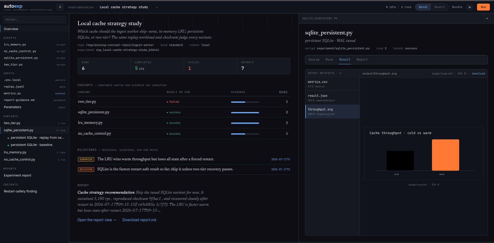
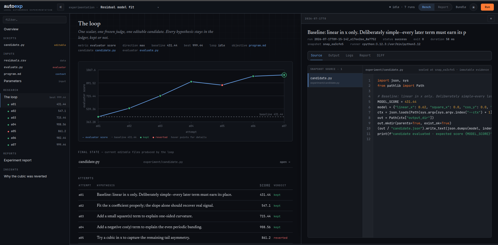

<p align="center">
  
</p>

# autoexp

**Turn your coding agent into a disciplined experimenter.**

Autoexp is an agent-first plugin for running experiments and Autoresearch inside an existing Git repository. Tell Codex, Claude Code, or another Agent Skills-compatible coding agent what you want to test. The agent adapts the repository, runs focused variants, compares evidence, and brings the results back through a visual review surface.

You do not create an Autoexp project, maintain a second workspace, or hand-configure run folders. Your repository stays the editable source of truth; Autoexp gives the agent a local execution ledger for immutable source snapshots, logs, artifacts, diffs, reports, scores, and decisions.

- **Agent-native** — describe the goal in natural language; the installed skill handles the workflow.
- **Works in the repo you already have** — no `.autoexp`, generated agent instructions, or copied project tree.
- **Standard experiments and Autoresearch** — compare open-ended variants or optimize against a frozen scalar evaluator.
- **Evidence, not chat history** — every attempt remains inspectable and reproducible, including failures and reverted candidates.
- **Human review when it matters** — the agent can open a browser handoff and receive your scoped feedback directly.



## Install and connect your agent

Install the runtime and bare agent commands in one step:

```bash
curl -fsSL https://raw.githubusercontent.com/shreyashkar-ml/autoexp/main/install.sh | bash
```

The installer updates the `autoexp` CLI and installs `$autoexp` / `$autoexp-review` for Codex plus `/autoexp` / `/autoexp-review` for Claude Code. Restart your agent after installation.

Supports macOS, Linux, and WSL. Requires `uv`, Git, curl, and Python 3.11+. Docker is optional per experiment. Autoexp does not need a model API key or an MCP server.

<details>
<summary>CLI-only or marketplace installation</summary>

```bash
uv tool install "git+https://github.com/shreyashkar-ml/autoexp.git"
```

This installs only the runtime. The plugin marketplaces remain available, but plugin-provided skills are necessarily namespaced:

```bash
codex plugin marketplace add shreyashkar-ml/autoexp
codex plugin add autoexp@autoexp

claude plugin marketplace add shreyashkar-ml/autoexp
claude plugin install autoexp@autoexp
```

</details>

Other Agent Skills hosts can install the two directories under `plugins/autoexp/skills` with their normal skill mechanism.

## Use Autoexp from your agent

Autoexp exposes two agent workflows:

| Workflow | Codex | Claude Code |
| --- | --- | --- |
| Start or continue experiments | `$autoexp <objective>` | `/autoexp <objective>` |
| Open browser feedback review | `$autoexp-review` | `/autoexp-review` |

Open your existing repository and give the experimentation workflow the outcome, not the plumbing:

```text
$autoexp Compare the cache strategies in this repository. Reuse the existing
replay benchmark, preserve every run, and recommend a winner from the evidence.
```

In Claude Code, the equivalent is:

```text
/autoexp Compare the cache strategies in this repository. Reuse the existing
replay benchmark, preserve every run, and recommend a winner from the evidence.
```

The plugin teaches the agent to:

1. inspect the current worktree and understand the experiment objective;
2. create or adapt ordinary repository scripts, benchmarks, inputs, and evaluators when needed;
3. register the objective and relevant files in Autoexp’s global ledger;
4. make one focused change at a time and run it as immutable evidence;
5. inspect source, output renderers, logs, reports, and diffs before deciding what to try next;
6. preserve the conclusion outside the repository and open a review handoff when your judgement is needed.

```text
You describe the experiment
          ↓
Your agent edits and runs the existing repository
          ↓
Autoexp seals every attempt, artifact, score, and diff
          ↓
Browser review returns structured feedback to the agent
```

Autoexp creates no repository-local configuration, `runs/` directory, `.mcp.json`, `.codex`, or generated report files. If the repository lacks an experiment harness, the agent creates normal project files that follow the repository’s conventions—not Autoexp scaffolding.

## Two experimentation flows

### Standard experiments

Use Standard mode for qualitative, comparative, exploratory, and multi-variant work: prompt comparisons, architecture alternatives, benchmark studies, data transformations, simulation outputs, or any investigation where one scalar cannot decide the winner.

The agent iterates through normal repository changes and asks Autoexp to seal each run. Autoexp keeps the exact source, runner identity, logs, outputs, artifacts, lineage, and diff, while the agent reasons across the complete record instead of relying on conversation memory.

### Autoresearch

Use Autoresearch only when a stable scalar metric and a frozen evaluator can automatically decide whether a candidate should be kept or reverted.

```text
Use Autoexp Autoresearch to improve validation_accuracy in this repository.
Treat research/evaluate.py as frozen, change one candidate idea per attempt,
and stop after 20 attempts or three attempts without improvement.
```

The agent creates or adapts three ordinary repository boundaries—a research program, an editable candidate, and a frozen evaluator—then Autoexp enforces the loop:

1. read the program and current contract state;
2. make one focused candidate edit;
3. execute an immutable run and extract the configured metric;
4. keep an improvement or restore the prior best;
5. retain the hypothesis, score, verdict, artifacts, and diff either way.



A deliberate evaluator change starts a new contract boundary. Reverted attempts remain first-class evidence; only the current-best pointer moves back.

## Review results with the agent

Invoke the review workflow when you want to inspect results or steer the next step:

```text
$autoexp-review
```

Use `/autoexp-review` in Claude Code. The agent runs `autoexp review`, which opens a short-lived local browser session and blocks the agent at the review boundary. You can inspect source, rendered artifacts, CSV tables, images, logs, reports, and diffs; attach notes to the relevant run, file, document, or attempt; and submit one structured feedback batch. The notes return directly to the waiting agent as its next instruction.

Ordinary `autoexp view` sessions remain read/download-only. Review tokens are stored only as hashes, expire, and cannot be submitted twice.

## What Autoexp records

Every execution links:

- the immutable snapshot of declared, non-secret source;
- the trigger, runner identity, duration, exit status, and lineage;
- stdout, stderr, output hashes, reports, and indexed artifacts;
- source diffs and milestones across runs;
- external-input provenance and safe secret availability metadata;
- the Autoresearch hypothesis, metric, score, and kept/reverted verdict when applicable.

Live repository edits never change historical evidence. Restoring a run is explicit and copies only declared non-secret, non-generated, non-frozen files back into the worktree.

All registered repositories and worktrees appear in one local dashboard. Each canonical Git worktree path has its own identity, so concurrent worktrees remain separate.

## Direct CLI reference

Most users let the plugin drive these commands. They remain available for inspection, automation, and debugging:

| Task | Command |
| --- | --- |
| Show registered experiments | `autoexp experiment list` |
| Inspect recent runs | `autoexp status` |
| Open the global dashboard | `autoexp view` |
| Compare two immutable runs | `autoexp diff <run-a> <run-b>` |
| Restore declared source from a run | `autoexp restore <run-id>` |
| Check the selected experiment and runtime | `autoexp doctor` |
| Open a blocking agent review | `autoexp review` |

<details>
<summary>What the agent runs for a Standard experiment</summary>

```bash
autoexp experiment create "<objective>" --title "<title>" --entrypoint <path> --command "<command>"
autoexp files add <path> --role editable-source
autoexp files add <path> --role supporting-source
autoexp files add <path> --role input-data
autoexp run --agent --title "<variant or hypothesis>"
```

The agent can attach reports and insights without writing generated documents into the repository:

```bash
autoexp document add /tmp/findings.md --kind insight --title "<title>"
autoexp document add /tmp/report.md --kind report --title "<title>"
```

</details>

<details>
<summary>What the agent runs for Autoresearch</summary>

```bash
autoexp experiment create "<objective>" --kind autoresearch \
  --program <program> --candidate <candidate> --evaluator <evaluator> \
  --metric <name> --direction <min|max> \
  --metric-kind json --metric-path metrics.json --metric-key <key>

autoexp research preflight
autoexp research state
autoexp research attempt "<hypothesis>"
```

</details>

## Local data and secrets

Autoexp stores its ledger in one global SQLite database and one private bare Git snapshot repository per registered worktree. Ordinary repository files remain where they are.

Default data directory:

- Linux: `$XDG_DATA_HOME/autoexp` or `~/.local/share/autoexp`
- macOS: `~/Library/Application Support/autoexp`
- Windows: `%LOCALAPPDATA%/autoexp`

Set `AUTOEXP_HOME` to override it. Use `autoexp relink <repo-id> <new-path>` if a worktree moves.

Secret-source values are never stored in SQLite, source snapshots, logs, reports, the API, or the browser. Autoexp records only key names and populated/empty availability, resolves values at runner handoff, and redacts them from durable text.

## Import older repo-local projects

```bash
autoexp import /path/to/old-project
```

The importer copies 0.2 history into the global model without changing or deleting the source project. It validates record counts, private-Git snapshot hashes, and artifact hashes before reporting success.

## Development

```bash
uv run pytest
cd frontend && npm install && npm run build
```

The Vite build writes the bundled dashboard to `autoexp/ui`. Autoexp itself has no runtime Python dependencies.
